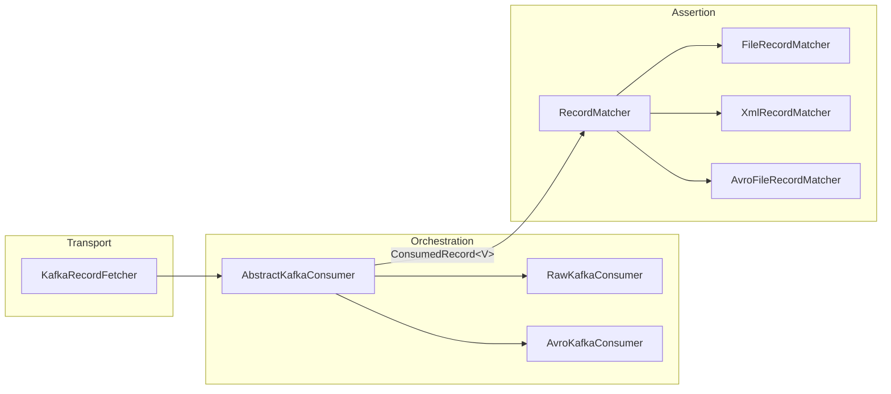

<p align="center">
  
</p>

<p align="center">
  
  
  
  
</p>

<br/>

**ktestify-core** is the foundation library of the [ktestify](https://github.com/ktestify) ecosystem. It provides a fluent Java API for asserting Kafka message flows : produce a record, consume it, match it against an expected file or value.

It is the engine that powers [ktestify-cucumber](https://github.com/ktestify/ktestify-cucumber), and can also be used directly in any JUnit 5 / TestNG / custom test harness.

---

## Installation

```xml
<dependency>
  <groupId>io.github.ktestify</groupId>
  <artifactId>ktestify-core</artifactId>
  <version>0.1.3-SNAPSHOT</version>
  <scope>test</scope>
</dependency>
```

---

## Quick Start

### Produce a raw record

```java
Topic inputTopic = Topic.builder()
    .topicName("orders")
    .topicType(Topic.Type.INPUT)
    .topicNamespace(Topic.TopicNamespace.builder().namespace("my-org").build())
    .build();

Producer<String, String> producer = KafkaClientFactory.createRawProducer();

ProducerContext<String, String> ctx = ProducerContext.<String, String>builder()
    .topic(inputTopic)
    .producer(producer)
    .payloadFile(new File("src/test/resources/order.json"))
    .recordKey("ORD-001")
    .build();

new RawKafkaProducer(ctx).send();
```

### Consume and assert

```java
Topic outputTopic = Topic.builder()
    .topicName("orders-processed")
    .topicType(Topic.Type.OUTPUT)
    .topicNamespace(Topic.TopicNamespace.builder().namespace("my-org").build())
    .build();

Consumer<String, String> consumer = KafkaClientFactory.createRawConsumer();

ConsumerContext<String, String> ctx = ConsumerContext.<String, String>builder()
    .topic(outputTopic)
    .consumer(consumer)
    .matchMethod(RecordMatcherFactory.METHOD_MATCH_FILE)
    .matchFilePath("src/test/resources/expected/order.json")
    .expectedRecordKey("ORD-001")
    .readTimeout(30_000L)       // ms
    .consumerDeltaTime(60_000L) // ms — how far back to seek
    .build();

boolean passed = new RawKafkaConsumer(ctx).call();
assertThat(passed).isTrue();
```

---

## Architecture

ktestify-core enforces a **strict three-layer separation**. `ConsumedRecord<V>` is the only type that crosses layer boundaries — matchers have zero knowledge of Kafka, and the transport layer has zero knowledge of assertions.



**Transport** — knows offsets, partitions, polling, deduplication. Nothing else.  
**Orchestration** — wires fetch → match → result. No Kafka internals, no comparison logic.  
**Assertion** — receives `List<ConsumedRecord<V>>` and a `MatchContext`. No transport knowledge.

Adding a new transport (IBM MQ, Amazon SQS, …) means implementing `RecordFetcher<V>` — existing matchers work unchanged.

---

## Core Concepts

### `ConsumerContext<K, V>`

Immutable builder that configures a consumer invocation. Validated on `build()` — the topic must be of type `OUTPUT`.

```java
ConsumerContext.<String, String>builder()
    .topic(outputTopic)
    .consumer(KafkaClientFactory.createRawConsumer())
    .matchMethod(RecordMatcherFactory.METHOD_MATCH_XML)
    .matchFilePath("expected/response.xml")
    .excludedFields(List.of("CreationDateTime", "MessageId"))
    .expectedRecordKey("ORD-001")
    .readTimeout(30_000L)
    .consumerDeltaTime(60_000L)
    .isBatchConsumer(false)
    .build();
```

| Field | Type | Description |
|---|---|---|
| `topic` | `Topic` | OUTPUT topic to consume from |
| `consumer` | `Consumer<K,V>` | Kafka consumer instance (use `KafkaClientFactory`) |
| `matchMethod` | `String` | Matcher strategy constant from `RecordMatcherFactory` |
| `matchFilePaths` | `List<String>` | Expected file(s) — single or one-per-batch-record |
| `excludedFields` | `List<String>` | Fields to skip during comparison |
| `expectedRecordKey` | `String` | Optional key filter |
| `readTimeout` | `Long` | Timeout in **milliseconds** |
| `consumerDeltaTime` | `Long` | How far back to seek, in **milliseconds** |
| `isBatchConsumer` | `boolean` | Enable batch mode |
| `batchSize` | `int` | Expected number of records in batch mode |

### `ProducerContext<K, V>`

Immutable builder that configures a producer invocation. The topic must be of type `INPUT`.

```java
ProducerContext.<String, GenericRecord>builder()
    .topic(inputTopic)
    .producer(KafkaClientFactory.createAvroProducer())
    .payloadFile(new File("src/test/resources/order.json"))
    .schemaName("Order")          // SR subject: "Order-value"
    .recordKey("ORD-001")
    .headers(Map.of("X-Source", "ktestify"))
    .build();
```

### `KafkaClientFactory`

Convenience factory that creates pre-configured Kafka clients from the loaded `KtestifyConfig`.

```java
// Raw
Producer<String, String>        p  = KafkaClientFactory.createRawProducer();
Consumer<String, String>        c  = KafkaClientFactory.createRawConsumer();

// Avro
Producer<String, GenericRecord> ap = KafkaClientFactory.createAvroProducer();
Consumer<String, GenericRecord> ac = KafkaClientFactory.createAvroConsumer();

// Custom group ID
Consumer<String, String>        c2 = KafkaClientFactory.createRawConsumer("my-test-group");
```

Every consumer gets a unique group ID suffix by default to ensure independent consumption across parallel tests.

---

## Matchers

Matchers are resolved via `RecordMatcherFactory` or injected explicitly into the consumer constructor.

### Available strategies

| Constant | Raw | Avro | Description |
|---|:---:|:---:|---|
| `METHOD_MATCH_FILE` | ✅ | ✅ | Record value vs. expected file |
| `METHOD_MATCH_KEY_FILE` | ✅ | ✅ | Record key + value vs. expected key + file |
| `METHOD_FIELDS_TO_MATCH` | ✅ | ✅ | Positional field extraction (`line:from:to`) |
| `METHOD_MATCH_XML` | ✅ | — | XML structural comparison |
| `METHOD_MATCH_XPATH` | ✅ | — | XPath expression list |
| `METHOD_RECORD_KEY_MATCH` | ✅ | ✅ | Record key only |
| `null` / blank | ✅ | ✅ | No-op — presence check only |

### Resolving a matcher

```java
// Raw (String)
RecordMatcher<String>        m = RecordMatcherFactory.forRaw(RecordMatcherFactory.METHOD_MATCH_XML);

// Avro (GenericRecord)
RecordMatcher<GenericRecord> m = RecordMatcherFactory.forAvro(RecordMatcherFactory.METHOD_MATCH_FILE);
```

### Custom matcher

```java
RecordMatcher<String> myMatcher = (records, ctx) -> {
    String actual = records.get(0).getValue();
    return actual.contains("ORD-001")
        ? MatchResult.pass()
        : MatchResult.fail("Expected ORD-001 in payload", "ORD-001", actual);
};

new RawKafkaConsumer(ctx, myMatcher).call();
```

### `MatchResult`

```java
MatchResult.pass()                               // assertion passed, no diff
MatchResult.pass(expected, actual)               // passed, with values for reporting
MatchResult.fail("diff message", expected, actual)
MatchResult.fail("message only")
```

---

## Batch Consumers

```java
ConsumerContext<String, String> ctx = ConsumerContext.<String, String>builder()
    .topic(outputTopic)
    .consumer(KafkaClientFactory.createRawConsumer())
    .isBatchConsumer(true)
    .batchSize(4)
    .matchMethod(RecordMatcherFactory.METHOD_MATCH_FILE)
    .matchFilePaths(List.of(
        "expected/order-1.json",
        "expected/order-2.json",
        "expected/order-3.json",
        "expected/order-4.json"
    ))
    .readTimeout(15_000L)
    .consumerDeltaTime(60_000L)
    .build();

boolean passed = new RawKafkaConsumer(ctx).call();
```

In batch mode the consumer polls until `batchSize` distinct records are collected or the timeout expires. Each file in `matchFilePaths` is matched to the record at the same index.

---

## Dynamic Variables

Payload files are processed transparently by `DynamicVariableProcessor` when read via `FileUtils.getFileContent()`. Use `{{VARIABLE:format}}` syntax inside any payload or expected file.

| Syntax | Output example |
|---|---|
| `{{date}}` | `2026-05-31` |
| `{{date:yyyy/MM/dd}}` | `2026/05/31` |
| `{{timestamp}}` | `2026-05-31T14:22:00` |
| `{{timestamp:HH:mm:ss}}` | `14:22:00` |
| `{{random}}` | UUID v4 |
| `{{random:str:12}}` | `aB3xZ9qWmK1p` |
| `{{random:num:6}}` | `482931` |
| `{{env:MY_VAR}}` | value of `$MY_VAR` |

```json
{
  "orderId":    "{{random:uuid}}",
  "createdAt":  "{{timestamp:yyyy-MM-dd'T'HH:mm:ss'Z'}}",
  "env":        "{{env:APP_ENV}}"
}
```

Register custom variables with `DynamicVariableFactory.registerVariable(myVar)`.

---

## Record Deduplication

`KafkaRecordFetcher` maintains a **static, JVM-wide registry** of matched records. Once a record is claimed by one consumer, it is invisible to every other consumer in the same run — preventing false positives in parallel scenarios.

```java
// Required in your @BeforeEach / @Before hook
KafkaRecordFetcher.clearMatchedRecords();
```

Deduplication is keyed on `(topic, partition, offset, key, timestamp)` — not on payload content.

---

## Configuration

ktestify-core uses [Typesafe Config](https://github.com/lightbend/config) (HOCON). Values resolve in this priority order:

```
System properties  >  env variables  >  application.conf  >  reference.conf (defaults)
```

Place your `application.conf` on the classpath, or pass `-Dconfig.file=path/to/your.conf` at runtime.

```hocon
ktestify {
  kafka {
    bootstrap-servers = "localhost:9092"
    bootstrap-servers = ${?KAFKA_BOOTSTRAP_SERVERS}
    topic-namespace   = ${?KTESTIFY_TOPIC_NAMESPACE}

    consumer.group-id = "my-test-group"
  }

  schema-registry {
    url = "http://localhost:8081"
    url = ${?SCHEMA_REGISTRY_URL}
  }

  framework.timeouts {
    default-read-timeout = 10s
    consumer-delta-time  = 20s
    poll-interval        = 100ms
    buffer-time          = 5s
  }

  framework.directories {
    assets = ""   # ${?KTESTIFY_ASSETS_DIR}
  }
}
```

### Programmatic config (useful in tests)

```java
KtestifyConfig config = ConfigBuilder.create()
    .bootstrapServers("kafka:9092")
    .schemaRegistryUrl("http://schema-registry:8081")
    .defaultReadTimeout(Duration.ofSeconds(30))
    .consumerDeltaTime(Duration.ofSeconds(60))
    .assetsDirectory("src/test/resources/data")
    .build();
```

---

## Timeout Architecture

Two intentional timeout layers protect every consumer call:

| Layer | Where | Purpose |
|---|---|---|
| **Inner** | `KafkaRecordFetcher` poll loop | Exits as soon as the first matching record is found |
| **Outer** | `AbstractKafkaConsumer` via `ExecutorService` | Safety net — `get(readTimeout + BUFFER_TIME)` catches JVM-level hangs |

`BUFFER_TIME` defaults to `5s` (`ktestify.framework.timeouts.buffer-time`).

---

## Plugin System

ktestify-core ships a `KtestifyPlugin` SPI for extending the framework with new transports or capabilities.

```java
public class MyPlugin implements KtestifyPlugin {
    @Override public String getId()          { return "my-transport"; }
    @Override public String getVersion()     { return "1.0.0"; }
    @Override public String getAuthorName()  { return "Your Name"; }
    @Override public String getGluePackage() { return "com.example.steps"; }

    @Override
    public void initialize(PluginContext ctx) {
        // read plugin config: ctx.getConfig().getRaw()
        //   under "ktestify.plugins.my-transport"
    }

    @Override public void shutdown() { /* release resources */ }
}
```

Declare in `META-INF/services/io.github.ktestify.plugin.KtestifyPlugin`. Plugins are discovered via `ServiceLoader` before any scenario runs. External `.jar` plugins can be dropped into `ktestify.plugins.dir` and are loaded via a dedicated `URLClassLoader`.

---

## Related

- **[ktestify-cucumber](https://github.com/ktestify/ktestify-cucumber)** — BDD / Gherkin runner built on ktestify-core
- **[docs.ktestify.xyz](https://docs.ktestify.xyz)** — full documentation and configuration reference

---

## Contributing

Contributions are welcome. Please read the contributing guide before opening a pull request.

1. Fork the repository
2. Create a feature branch — `git checkout -b feat/my-feature`
3. Commit with [Conventional Commits](https://www.conventionalcommits.org/) — `git commit -m "feat: add my feature"`
4. Push and open a Pull Request against `main`

---

## License

ktestify-core is licensed under the [Apache License 2.0](LICENSE).

---


<p align="center">
  
  <br/>
  <sub>Assert the stream. Own the pipeline.</sub>
</p>